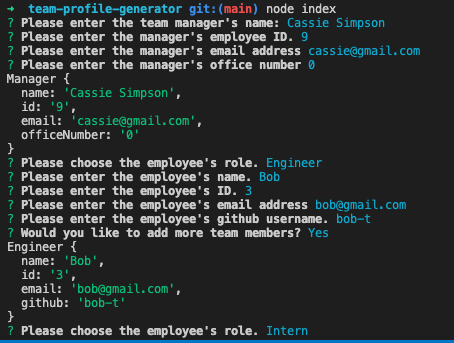

# Team Profile Generator
  
  ## Description
  This project demonstrates the concepts of Object Oriented Programming and Test-Driven Development using Jest. The Team Profile Generator can be used to generate a team profile based on user input.

  
  ## Table of Contents
  * [Installation](#installation)
  * [Usage](#usage)
  * [License](#license)
  * [Contributing](#contributing)
  * [Tests](#tests)
  * [GitHub](#github)

  ## Installation
  This project requires installation of Node, the File System Module, and the Inquirer module. Jest should also be installed for further testing.

  ## Usage
  Run `node index` at the command line and answer questions about your team.   
  

  ## License
    
  This project uses  the [MIT](https://opensource.org/licenses/MIT) license.

  ## Contributing
  This project follows the Contributor Covenant.  
  

  ## Tests
  Run `npm test` to run Jest for tests on constructors. 

  ## Questions
  Reach out via email or GitHub.  
  cassie.s.simpson@gmail.com  
  [cassie-s](https://github.com/cassie-s/)

  

